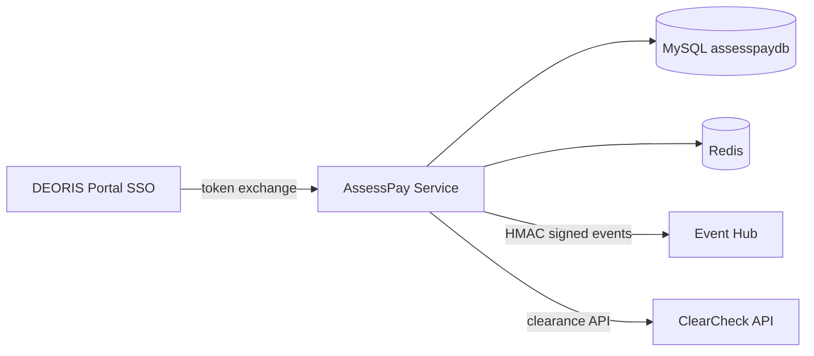

# AssessPay SOA Architecture

## Principles

- **Own database** — no cross-service joins
- **REST + events** — external communication only
- **Portal SSO** — no standalone auth
- **Role enforcement** — Cashier confirms; Admin read-only; Student pay/view only

## Service identity

| Key | Env |
|-----|-----|
| service_key | `ASSESSPAY_SERVICE_KEY` |
| event_secret | `ASSESSPAY_EVENT_SECRET` |
| queues | payments, billing, notifications, events |

## Event catalog

- `TuitionPaid`, `BalanceUpdated`, `ReceiptGenerated`, `PaymentConfirmed`, `FinancialRecordUpdated`

Each outbox row includes: event_id, event_name, source_service, payload, timestamp, schema_version, correlation_id, HMAC signature, nonce.
